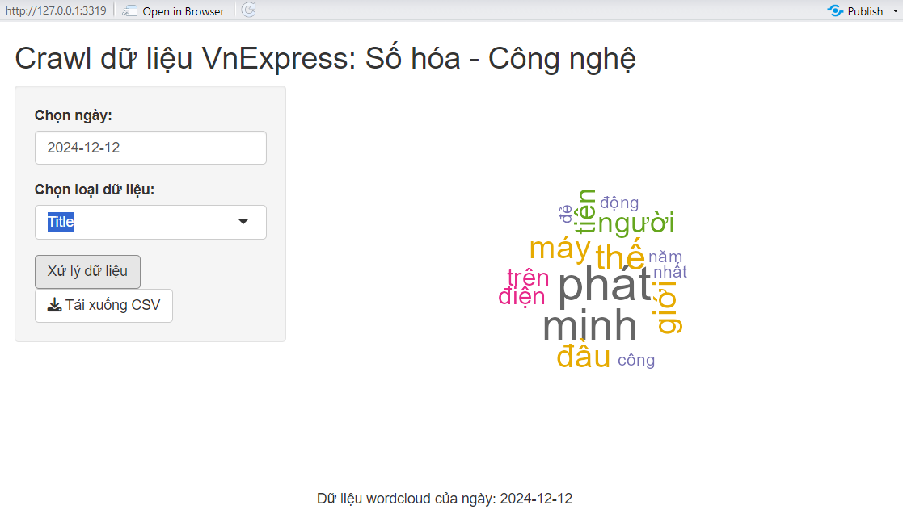
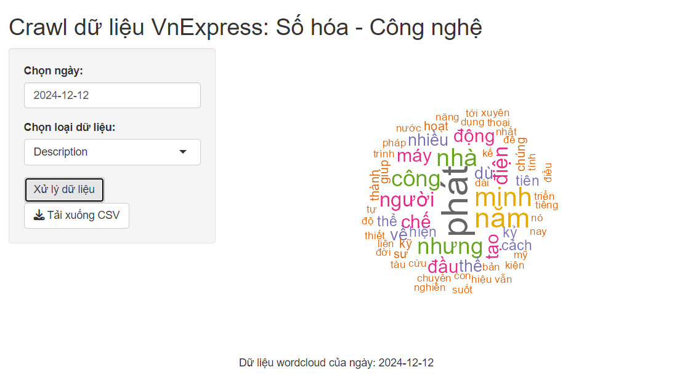
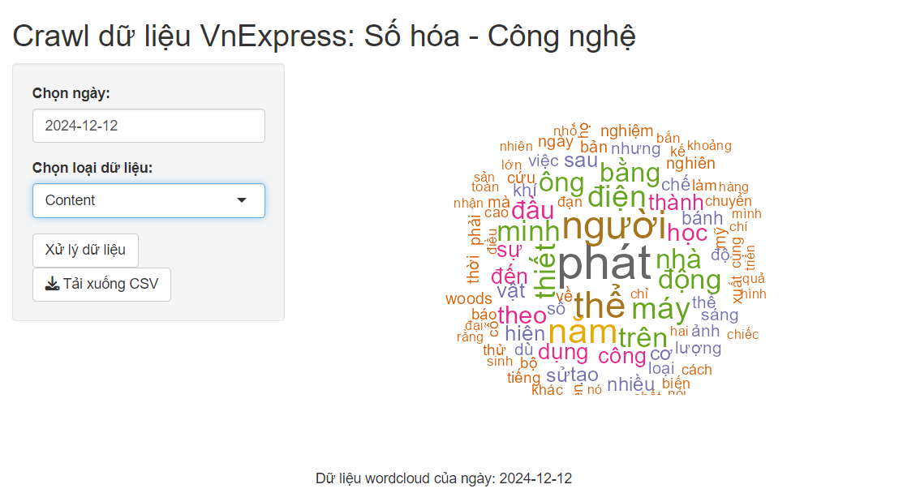
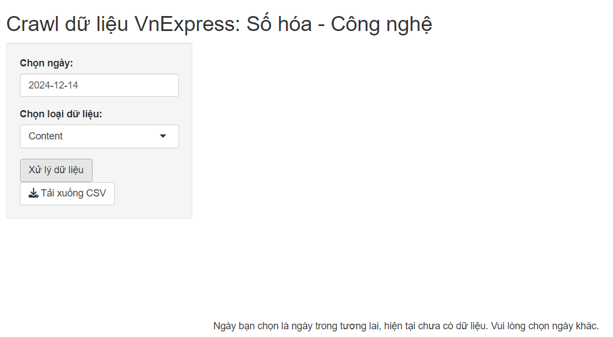
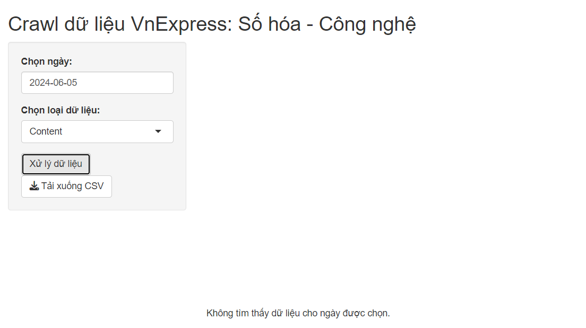

# VnExpress Crawler chủ đề Số hóa - Công nghệ

## Giới thiệu
Dự án này cung cấp một giao diện web đơn giản sử dụng Shiny để crawl dữ liệu bài viết từ chém **Số hóa - Công nghệ** của trang VnExpress. Người dùng có thể:

- Lựa chọn ngày để xử lý dữ liệu.
- Tạo word cloud từ dữ liệu crawl được.
- Tải xuống file CSV chứa thông tin bài viết.

## Screenshots
- Dữ liệu crawl được trong ngày

|                                   |                                  |                                  |
| :---:                             | :---:                            | :---:                            |
| Title                             | Description                      | Content                          |
|   |  |  |

- Không hiển thị dữ liệu khi chọn ngày trong tương lai hoặc dữ liệu trước đó chưa có sẵn

|                                   |                                       |
| :---:                             | :---:                                 |
| Khi chọn ngày trong tương lai     | Khi dữ liệu trong quá khứ chưa có sẵn |
|   |       |

## Chức năng

1. **Crawl dữ liệu**: Tự động thu thập danh sách bài viết từ chủ đề **Số hóa - Công nghệ**. (https://vnexpress.net/so-hoa/cong-nghe)
2. **Tạo word cloud**: Trình bày word cloud từ dữ liệu bài viết dựa trên tiêu đề, mô tả hoặc nội dung.
3. **Tải file CSV**: Xuất dữ liệu đã crawl ra file CSV.
4. **Xử lý ngày hợp lệ**: Kiểm tra tình hợp lệ của ngày được chọn.

## Yêu cầu hệ thống

- R version >= 4.0.0
- Các package:
  - shiny
  - rvest
  - dplyr
  - wordcloud
  - tm

## Hướng dẫn cài đặt

1. Clone repo:
   ```bash
   git clone https://github.com/thanhdangg/Visual_Paper
   cd Visual_Paper
   ```
2. Cài đặt package trong R:
   ```R
   install.packages(c("shiny", "rvest", "dplyr", "wordcloud", "tm"))
   ```

3. Chạy app Shiny:
   ```R
   shiny::runApp()
   ```

## Cách sử dụng

1. **Mở giao diện web**:
   - Khi chạy app, một giao diện web sẽ được khởi chạy tại `http://127.0.0.1:xxxx/`.

2. **Chọn ngày**:
   - Chọn ngày mong muốn để xem dữ liệu, chọn loại dữ liệu cần xem (Title, Description, Content).

3. **Xử lý dữ liệu**:
   - Nhấn nút "Xử lý dữ liệu" để bắt đầu crawl và tạo word cloud.

4. **Tải CSV**:
   - Sau khi xử lý, nhấn "Tải xuống CSV" để lấy dữ liệu bài viết.

## Các thành phần chính

### 1. `crawl_vnexpress`
Hàm dùng để:
- Crawl dữ liệu từ trang VnExpress.
- Trả về DataFrame bao gồm:
  - Tiêu đề.
  - URL.
  - Mô tả.
  - Nội dung chi tiết.

### 2. Giao diện UI
Gồm các phần:
- **Sidebar**: Cho phép người dùng chọn ngày và loại dữ liệu.
- **Main Panel**: Hiển thị word cloud và thông báo.

### 3. Server
Xử lý logic bao gồm:
- Kiểm tra tính hợp lệ của ngày.
- Crawl dữ liệu và tạo word cloud.
- Xử lý tải xuống file CSV.

## Lưu ý
- Các file CSV sẽ được lưu trong thư mục `data/`.
- Dữ liệu chỉ crawl cho ngày hiện tại hoặc ngày trong dãy dữ liệu có sẵn.
